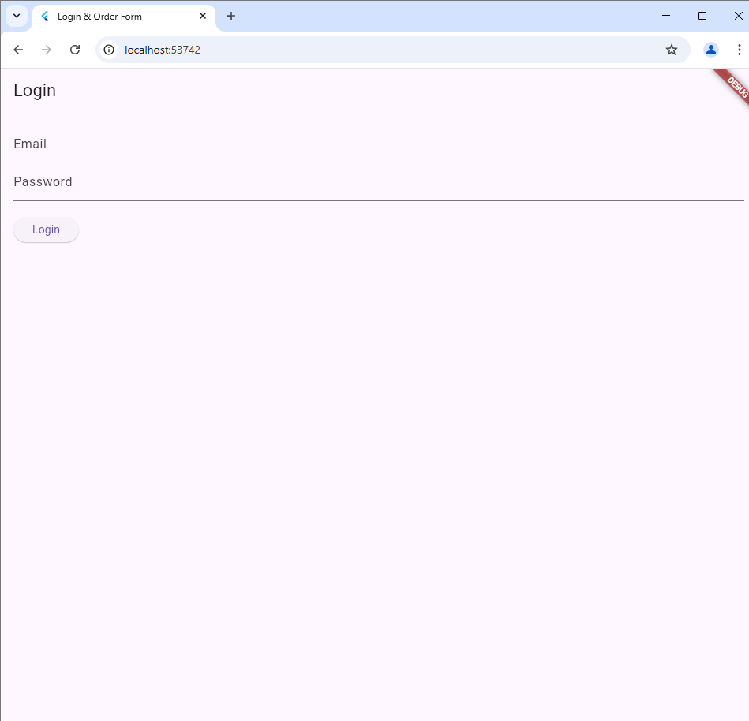
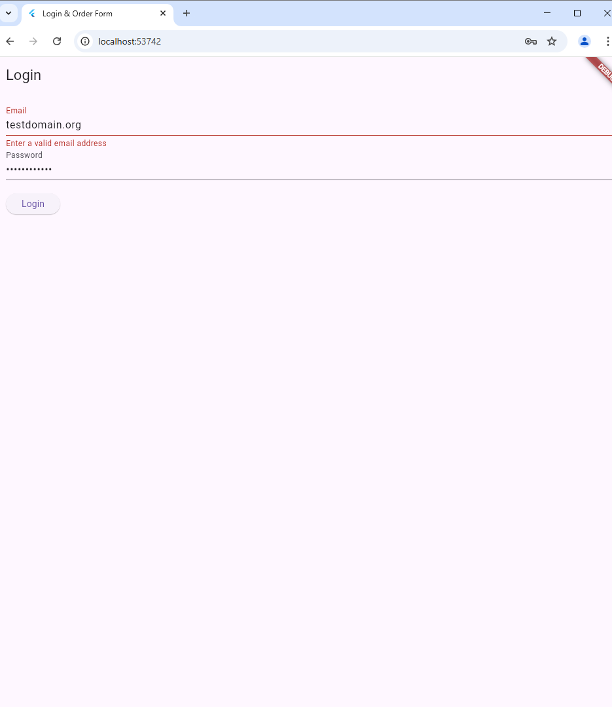
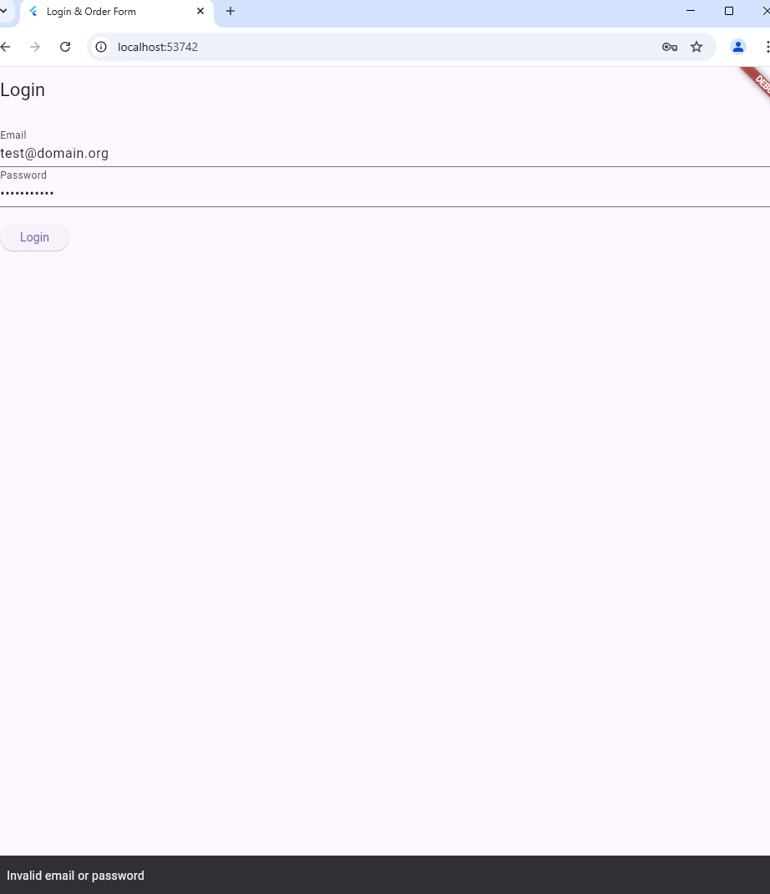
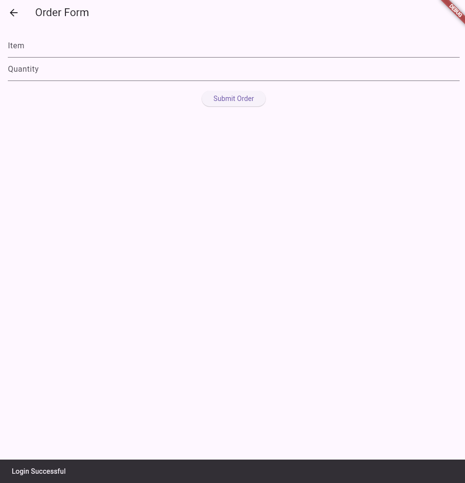
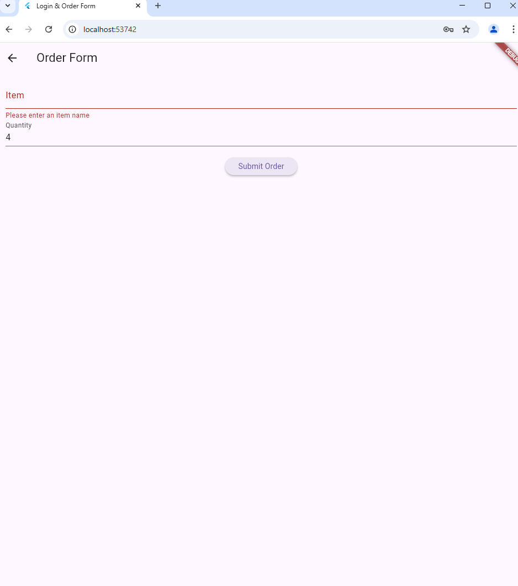
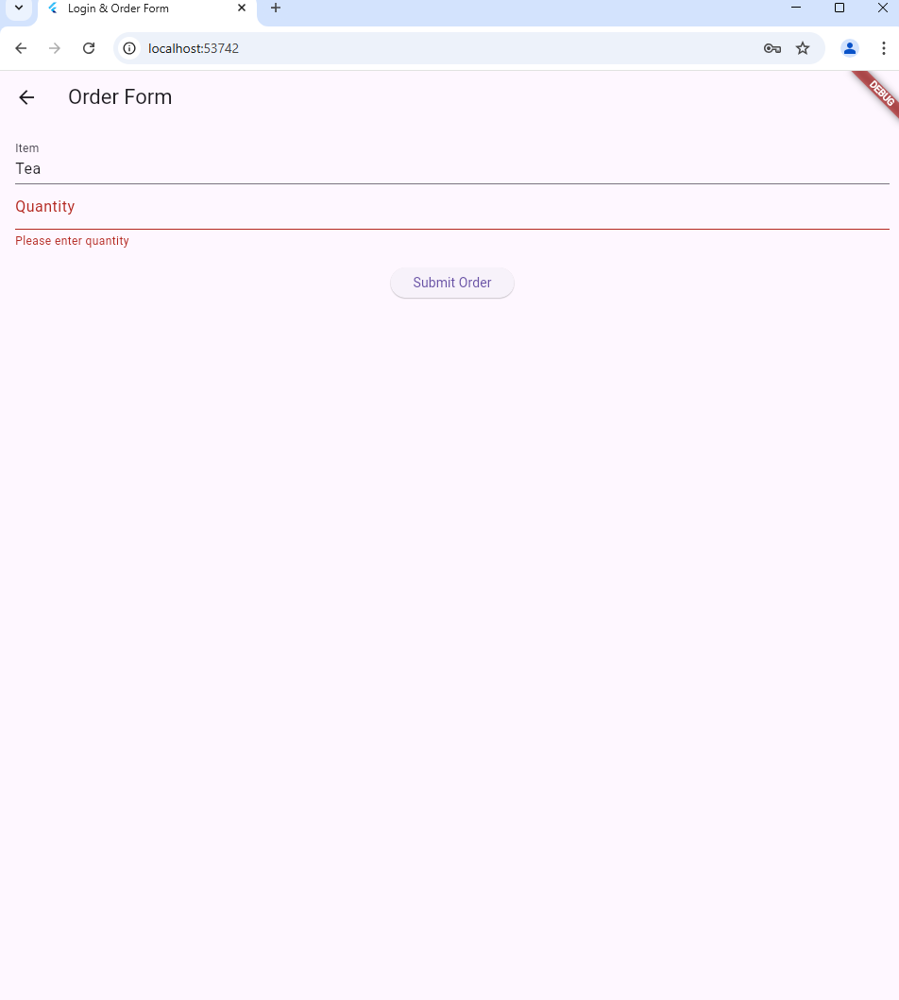
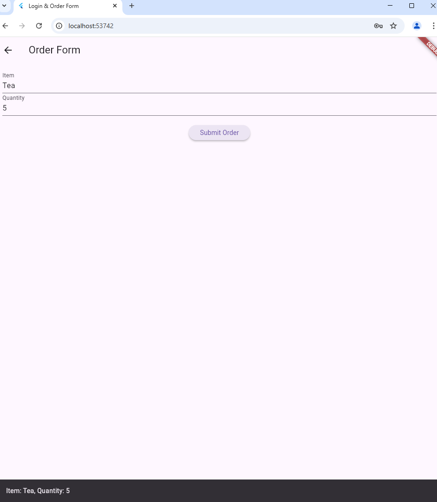

# Login & Order Form App

This is a Flutter-based mobile application that implements a **Login Screen** and an **Order Form**. The application validates the user’s email and password, and upon successful login, allows the user to place an order by entering an item and quantity.

---

## Project Details

- **Author:** Abebe Megibar
- **Student ID:** UGR/3819/13
- **Course Name:** Mobile Application Development
- **Instructor:** Instructor Ashenafi Kassahun

---

## Features

- **Login Screen**:

  - Email validation (must contain "@" and end with ".org").
  - Password validation (must be >8 characters, include at least one uppercase letter, one lowercase letter, and a number).
  - Hardcoded credentials:
    - Email: `test@domain.org`
    - Password: `StrongPass123`

- **Order Form**:
  - Allows users to input an item name and quantity.
  - The app displays the order details after submission.

---

## Screenshots

Here are some screenshots of the app in different states:

1. **Login Page**  
   

2. **Invalid Email**  
   

3. **Invalid Password**  
   

4. **Login Successful**  
   

5. **No Item Entered**  
   

6. **No Quantity Entered**  
   

7. **Successful Order**  
   

---

## Requirements

- **Flutter**: Make sure you have Flutter SDK installed on your system.

  - [Flutter Installation Guide](https://flutter.dev/docs/get-started/install)

- **IDE**: You can use Android Studio, VS Code, or IntelliJ IDEA to open and run this project.

---

## How to Run

1. Clone this repository
   ```sh
   git clone https://github.com/ablove/flutter-login-order-app.git
   ```
2. Navigate to the project directory
   ```sh
   cd flutter-login-order-app
   ```
3. Install dependencies
   ```sh
   flutter pub get
   ```
4. Run the app
   ```sh
   flutter run
   ```
